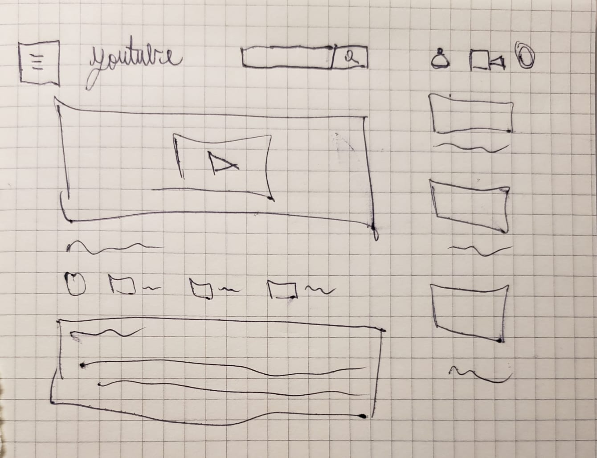
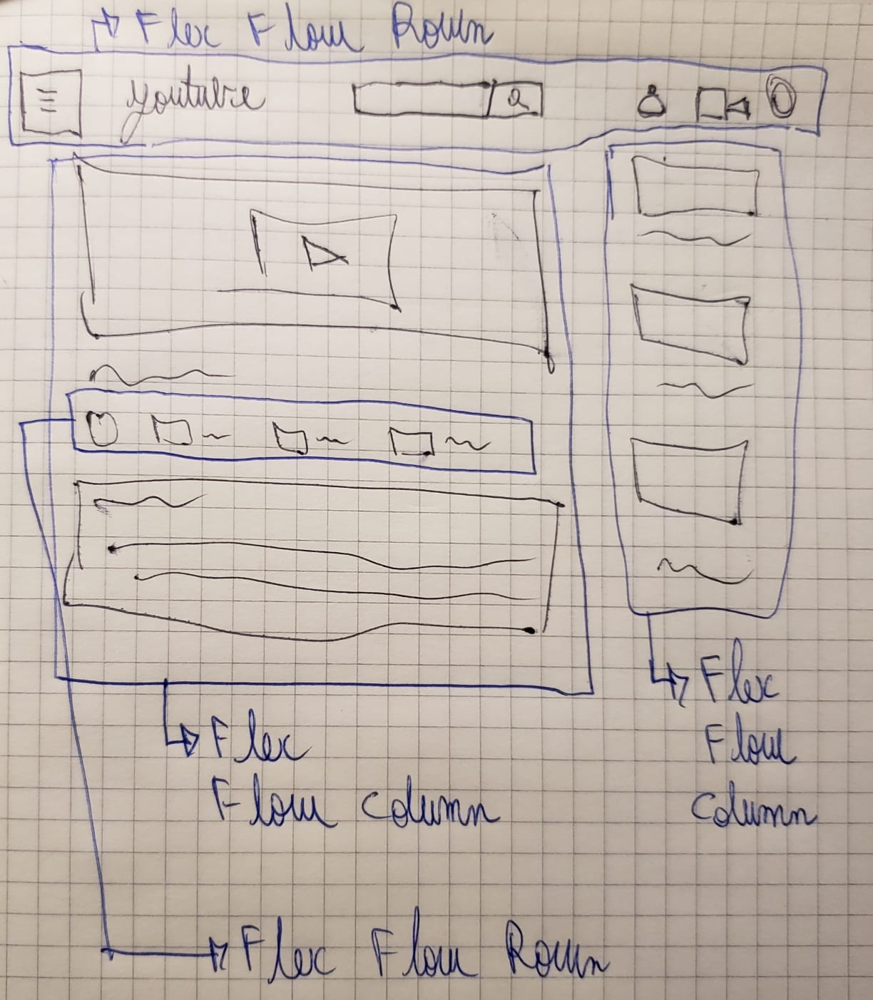
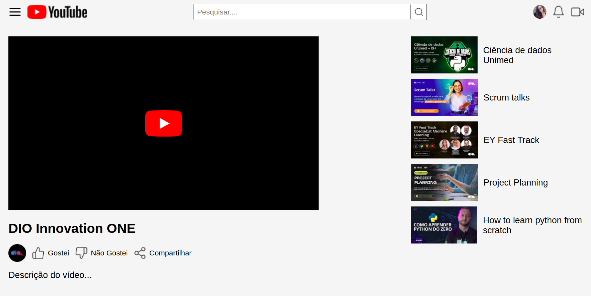

# Trilha CSS: Desafio YouTube

A **trilha 2** do curso de CSS da **DIO Innovation ONE** teve foco, entre outros atributos e elementos de CSS, o **FlexBox**.

Durante o final da trilha o mestre do curso colocou a execução deste projeto para término do mesmo.

### O que é _Flex Box_?

Em **pouquíssimas palavras**: O CSS Flexbox é um módulo de layout que facilita a criação de layouts complexos e responsivos, alinhando e distribuindo elementos dentro de um contêiner flexível.

#### Qual exemplo de Flex Box utilizando a página do YouTube deste projeto?

Este projeto visa construir Flex Box com diferentes direções, itens, textos, imagens, containers isolados e com outro dentro.

Observe a minha anotação a mão do layout de uma página do YouTube.

Agora obseve os traços com tinta azul, que demarcam quais são direções do **Flex Direction** de cada container.
Lembrando que em CSS é mais comum utilizar o **flex flow** para atribuir o **flex direction**, visto que podemos colocar o wrap logo em seguida.

Ficando assim: `Flex Flow: Column wrap;` ao invés de declarar duas vezes.

Observar nossa página com os olhos cheios de conhecimento para ver o layout com flex box. Torna-se diferente:

